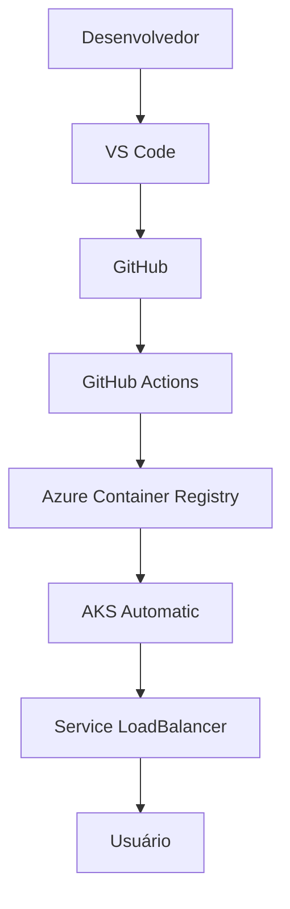

# painel-nuvem

Projeto didático para a disciplina de **Implantação de Software em Nuvem Privada e Nuvem Pública** (Estácio). Este repositório acompanha, passo a passo, o caminho completo de uma aplicação: do código escrito no VS Code até a execução pública em um cluster **AKS Automatic** na Azure.

## 1. Apresentação

Este projeto existe para que você veja, na prática, o que significa **implantar** (do inglês *deploy*) uma aplicação: pegar um código que roda na sua máquina e colocá-lo para funcionar de forma confiável em outro ambiente — seja um servidor da própria instituição (nuvem privada) ou um serviço gerenciado por um provedor como a Microsoft Azure (nuvem pública).

**Executar localmente** significa apenas rodar `npm start` no seu computador: só você acessa, e se o processo travar, ninguém mais é afetado.

**Implantar** significa empacotar essa aplicação em uma imagem Docker, publicar essa imagem em um registro de contêineres, e instruir um cluster Kubernetes a manter essa aplicação sempre no ar, com múltiplas cópias, monitoramento de saúde e um endereço público estável.

Ao final da aula você terá:

1. executado a aplicação localmente;
2. entendido a separação entre `app.js` (configuração) e `server.js` (inicialização);
3. construído uma imagem Docker;
4. executado essa imagem em um contêiner local;
5. publicado o código no GitHub;
6. construído e enviado a imagem para o Azure Container Registry (ACR);
7. implantado a aplicação no AKS Automatic;
8. acessado a aplicação por um endereço IP público;
9. consultado Pods, Services, eventos e logs do cluster;
10. atualizado a aplicação de `v1.0` para `v1.1`;
11. observado o GitHub Actions repetir automaticamente todo o processo;
12. removido os recursos do laboratório para não gerar custos.

## 2. Arquitetura



| Ferramenta | Responsabilidade no fluxo |
| --- | --- |
| VS Code | Editor onde o código-fonte é escrito e organizado. |
| GitHub | Armazena o histórico de versões do código e recebe o `git push`. |
| GitHub Actions | Executa automaticamente os testes, constrói a imagem Docker e implanta no AKS a cada `push` na branch `main`. |
| Azure Container Registry (ACR) | Guarda as imagens Docker construídas, prontas para serem baixadas pelo cluster. |
| AKS Automatic | Cluster Kubernetes gerenciado pela Azure, que executa os contêineres da aplicação. |
| Service LoadBalancer | Recurso do Kubernetes que expõe a aplicação com um IP público estável. |
| Usuário | Quem acessa a aplicação pela internet, usando o IP público do Service. |

## 3. Conceitos fundamentais

| Conceito | Explicação simples |
| --- | --- |
| Código-fonte | O texto do programa, escrito em uma linguagem como JavaScript, que descreve o que a aplicação deve fazer. |
| Imagem | Um "pacote fechado" contendo o código-fonte, as dependências e tudo o que é necessário para rodar a aplicação, sem depender do que já está instalado na máquina. |
| Contêiner | Uma imagem em execução. É como ligar a imagem: agora ela é um processo isolado, rodando de fato. |
| Dockerfile | A "receita" que descreve como construir uma imagem, passo a passo. |
| Registro de contêiner | Um "repositório" onde imagens Docker ficam guardadas e disponíveis para download. |
| ACR (Azure Container Registry) | O registro de contêiner oferecido pela Azure, privado para a sua assinatura. |
| Cluster | Um conjunto de máquinas (nós) que trabalham juntas para executar contêineres de forma coordenada, usando Kubernetes. |
| Pod | A menor unidade executável do Kubernetes; normalmente contém um contêiner da sua aplicação em execução. |
| Deployment | Um objeto do Kubernetes que garante que um determinado número de Pods de uma aplicação esteja sempre em execução, cuidando de reinícios e atualizações. |
| Service | Um objeto do Kubernetes que dá um endereço de rede estável para acessar os Pods, mesmo quando eles são recriados. |
| Namespace | Uma "pasta lógica" dentro do cluster, usada para separar e organizar recursos de diferentes times ou finalidades. |
| Manifesto | Um arquivo YAML que descreve, de forma declarativa, como um recurso do Kubernetes deve existir. |
| Pipeline | A sequência automatizada de etapas (testar, construir, publicar, implantar) executada pelo GitHub Actions a cada mudança no código. |
| OIDC | Um protocolo de autenticação que permite ao GitHub Actions provar sua identidade ao Azure usando um token temporário, sem depender de uma senha fixa guardada no repositório. |

## 4. Pré-requisitos

- Conta no GitHub.
- Assinatura ativa no Microsoft Azure (com permissão para criar grupos de recursos, ACR e AKS).
- Permissões necessárias na assinatura Azure para criar recursos e, idealmente, para configurar credenciais federadas no Microsoft Entra ID (ou apoio do administrador da assinatura).
- [Git](https://git-scm.com/downloads)
- [Visual Studio Code](https://code.visualstudio.com/)
- [Node.js 24](https://nodejs.org/)
- [Docker Desktop](https://www.docker.com/products/docker-desktop/)
- [Azure CLI](https://learn.microsoft.com/cli/azure/install-azure-cli)
- [kubectl](https://kubernetes.io/docs/tasks/tools/)
- Extensões recomendadas do VS Code (veja `.vscode/extensions.json`): Docker, Kubernetes, AKS, GitHub Actions e YAML.

Comandos para verificar as versões instaladas:

```bash
git --version
node --version
npm --version
docker --version
az version
kubectl version --client
```

Você também pode executar os scripts prontos:

```bash
# Linux/macOS
./scripts/check-prerequisites.sh

# Windows (PowerShell)
./scripts/check-prerequisites.ps1
```

## 5. Estrutura do projeto

```text
painel-nuvem/
├── .github/
│   └── workflows/
│       └── deploy.yml            # Pipeline de CI/CD (testes, build, push, deploy)
├── .vscode/
│   ├── extensions.json           # Extensões recomendadas do VS Code
│   └── tasks.json                # Tarefas rápidas (instalar, testar, buildar, etc.)
├── docs/
│   └── GUIA_DO_PROFESSOR.md      # Roteiro de condução da aula
├── manifests/
│   ├── namespace.yaml            # Namespace "aula-nuvem"
│   ├── configmap.yaml            # Variáveis de ambiente não sigilosas
│   ├── deployment.yaml           # Deployment da aplicação (com probes e segurança)
│   └── service.yaml              # Service LoadBalancer (porta 80 → 3000)
├── public/
│   └── index.html                # Interface visual da aplicação
├── scripts/
│   ├── check-prerequisites.sh    # Verifica ferramentas necessárias (Bash)
│   ├── check-prerequisites.ps1   # Verifica ferramentas necessárias (PowerShell)
│   ├── validate-local.sh         # Validação local completa (Bash)
│   ├── validate-local.ps1        # Validação local completa (PowerShell)
│   ├── inspect-aks.sh            # Inspeciona Pods, Services, eventos e logs no AKS
│   └── cleanup-azure.sh          # Remove os recursos Azure do laboratório
├── test/
│   └── health.test.js            # Testes automatizados de /healthz e /api/info
├── .dockerignore                 # Arquivos que não entram na imagem Docker
├── .editorconfig                 # Padronização de formatação entre editores
├── .env.example                  # Modelo de variáveis de ambiente
├── .gitignore                    # Arquivos que não devem ser versionados
├── app.js                        # Configuração da aplicação Express
├── server.js                     # Inicialização do servidor HTTP
├── Dockerfile                    # Receita da imagem Docker da aplicação
├── package.json                  # Dependências e scripts NPM
├── package-lock.json             # Versões travadas das dependências
├── LICENSE                       # Licença MIT
└── README.md                     # Este guia
```

## 6. Checkpoint 1 — Executar localmente

```bash
npm ci
npm start
```

Depois que o terminal exibir a mensagem de que o servidor está escutando, acesse:

```text
http://localhost:3000
http://localhost:3000/healthz
http://localhost:3000/api/info
```

**Resultado esperado:** a página inicial carrega com o título "Painel de Implantação em Nuvem", `/healthz` retorna o texto `ok`, e `/api/info` retorna um JSON com nome, versão, ambiente, data/hora e hostname.

## 7. Checkpoint 2 — Executar os testes

```bash
npm test
```

**O que está sendo testado:**

- que `GET /healthz` responde `200` com o texto `ok`;
- que `GET /api/info` responde `200` com um JSON contendo os campos `nome`, `versao`, `ambiente`, `dataHora` e `hostname`;
- que uma rota inexistente responde `404`.

Os testes usam o módulo nativo `node:test` e sobem a aplicação em uma porta aleatória, encerrando o servidor ao final de cada teste.

## 8. Checkpoint 3 — Construir a imagem

```bash
docker build -t painel-nuvem:v1.0 .
docker images painel-nuvem
```

- `docker build`: instrui o Docker a construir uma imagem seguindo as instruções do `Dockerfile`.
- `-t painel-nuvem:v1.0`: define o nome (*tag*) da imagem gerada, no formato `nome:versão`.
- `.`: indica que o contexto de build (os arquivos disponíveis para o Dockerfile) é o diretório atual.
- `docker images painel-nuvem`: lista as imagens locais cujo nome começa com `painel-nuvem`, para confirmar que a construção funcionou.

## 9. Checkpoint 4 — Executar o contêiner

```bash
docker run --rm -d \
  --name painel-nuvem \
  -p 3000:3000 \
  painel-nuvem:v1.0
```

```bash
docker ps
docker logs painel-nuvem
docker stop painel-nuvem
```

No PowerShell, o mesmo comando de execução deve ficar em uma única linha (ou usando o acento grave `` ` `` para quebrar linhas):

```powershell
docker run --rm -d --name painel-nuvem -p 3000:3000 painel-nuvem:v1.0
docker ps
docker logs painel-nuvem
docker stop painel-nuvem
```

Acesse `http://localhost:3000` para confirmar que o contêiner está respondendo da mesma forma que a execução local.

## 10. Checkpoint 5 — Publicar no GitHub

```bash
git init
git add .
git commit -m "Cria painel web containerizado"
git branch -M main
git remote add origin https://github.com/<usuario>/painel-nuvem.git
git push -u origin main
```

> Substitua `<usuario>` pelo seu usuário (ou organização) real do GitHub, e crie previamente um repositório vazio chamado `painel-nuvem` na sua conta.

## 11. Preparação do Azure

```bash
az login
az account list --output table
az account set --subscription "<nome-ou-id>"
az account show --output table
az provider register --namespace Microsoft.PolicyInsights --wait
az group create \
  --name rg-aula-aks-auto \
  --location brazilsouth
```

- **Assinatura**: é a "conta de cobrança" da Azure à qual os recursos do laboratório serão associados. Confirme que está usando a assinatura correta antes de criar qualquer recurso.
- **Região**: `brazilsouth` foi escolhida por proximidade, mas outra região pode ser usada conforme a disponibilidade de recursos (AKS Automatic nem sempre está disponível em todas as regiões — verifique com antecedência).
- **Grupo de recursos**: um "contêiner lógico" que agrupa todos os recursos Azure do laboratório (`rg-aula-aks-auto`), facilitando a exclusão de tudo ao final.
- **Bloqueios por política**: algumas assinaturas corporativas ou acadêmicas possuem políticas (*Azure Policy*) que podem impedir a criação de determinados recursos ou regiões. Caso isso ocorra, consulte o administrador da assinatura.
- **Custos**: a criação destes recursos pode gerar cobrança na assinatura Azure. É responsabilidade de quem executa o laboratório acompanhar os custos e remover os recursos ao final (veja a seção de limpeza).

## 12. Criação ou seleção do ACR

```bash
az acr create \
  --resource-group rg-aula-aks-auto \
  --name <acraulaidentificadorunico> \
  --sku Basic
```

> O nome do Azure Container Registry precisa ser **globalmente único** em toda a Azure, e aceita **somente letras minúsculas e números** (sem hífens ou espaços). Sugestão de padrão: `acraula` seguido de algo que identifique você ou sua turma, por exemplo `acraulaturma2026a`.

## 13. Criação do AKS Automatic

Este laboratório foi desenhado para que o cluster seja criado pelo **Portal do Azure**, usando o fluxo de implantação de aplicação conectado ao GitHub. O roteiro geral usado em aula é:

1. Acessar o serviço **Kubernetes Services** no Portal do Azure.
2. Selecionar a opção de criar uma implantação de aplicação a partir de um repositório.
3. Conectar o repositório GitHub do projeto (`painel-nuvem`).
4. Selecionar a branch `main`.
5. Selecionar o `Dockerfile` já existente no repositório.
6. Utilizar `.` (a raiz do repositório) como contexto de build.
7. Selecionar o Azure Container Registry criado anteriormente, ou permitir que o assistente crie um novo.
8. Informar que a aplicação escuta na porta `3000`.
9. Criar o cluster com o nome `aks-aula-auto` (ou selecionar um cluster AKS Automatic já existente com esse nome).
10. Utilizar o namespace `aula-nuvem` para os recursos da aplicação.
11. Revisar os arquivos gerados automaticamente pelo assistente (workflow do GitHub Actions e manifestos Kubernetes) antes de aceitar.
12. Revisar o Pull Request criado no repositório antes de fazer o merge.

> **Atenção:** a interface do Portal do Azure muda com frequência. Os nomes exatos de botões e telas podem ser diferentes do que está descrito aqui. Use este roteiro como guia conceitual e siga as instruções mostradas na tela no momento da aula.

Como alternativa a esse fluxo assistido, o professor pode optar por criar o cluster diretamente pela Azure CLI e usar apenas o workflow `deploy.yml` já incluído neste repositório — nesse caso, os passos 3 a 7 e 11 acima não se aplicam.

## 14. Configuração do OIDC

**O que é OIDC, em linguagem simples:** é um protocolo em que o GitHub Actions, no momento de cada execução, pede um "crachá temporário" (token) ao próprio GitHub, e esse crachá é apresentado ao Azure como prova de identidade. O Azure, previamente configurado para confiar nesse crachá, libera o acesso sem que nenhuma senha precise ser armazenada em lugar nenhum.

**Por que isso evita uma senha permanente:** um client secret tradicional é um valor fixo que, se vazar, pode ser usado por qualquer pessoa até ser revogado manualmente. O token OIDC é gerado a cada execução do workflow, expira em minutos e está atrelado a condições específicas (repositório, branch, evento) — reduzindo drasticamente o risco de uso indevido.

### Passo a passo conceitual

1. **No Microsoft Entra ID**, crie um registro de aplicativo (ou uma identidade gerenciada atribuída pelo usuário) que representará o GitHub Actions perante o Azure.
2. **No Azure**, conceda a essa identidade as permissões mínimas necessárias: papel de `AcrPush` (ou equivalente) no ACR e um papel com permissão de implantação no AKS (como `Azure Kubernetes Service RBAC Writer` ou o papel equivalente definido pela política da instituição), sempre restritos ao grupo de recursos `rg-aula-aks-auto`.
3. **Configure a credencial federada** no registro do aplicativo, apontando para o repositório GitHub e para a branch `main` (o Azure passa a confiar em tokens OIDC emitidos pelo GitHub especificamente para esse repositório e branch).
4. **No GitHub**, acesse as configurações do repositório (Settings → Secrets and variables → Actions).
5. Cadastre os **Secrets** com os identificadores da identidade (não são senhas, mas ainda assim são tratados como protegidos):

   ```text
   AZURE_CLIENT_ID
   AZURE_TENANT_ID
   AZURE_SUBSCRIPTION_ID
   ```

6. Cadastre as **Variables** (não sigilosas) usadas pelo workflow:

   ```text
   AZURE_RESOURCE_GROUP=rg-aula-aks-auto
   AZURE_AKS_CLUSTER=aks-aula-auto
   AZURE_ACR_NAME=acraula<identificador-unico>
   KUBERNETES_NAMESPACE=aula-nuvem
   IMAGE_NAME=painel-nuvem
   ```

7. **Revise as permissões concedidas** conforme a política institucional da sua organização ou universidade — em ambientes corporativos, esse tipo de configuração normalmente exige aprovação de um administrador da assinatura Azure.

| Nome | Onde é configurado | Tipo | Usado para |
| --- | --- | --- | --- |
| `AZURE_CLIENT_ID` | GitHub → Secrets | Secret | Identificar a aplicação/identidade no Entra ID |
| `AZURE_TENANT_ID` | GitHub → Secrets | Secret | Identificar o tenant (organização) no Entra ID |
| `AZURE_SUBSCRIPTION_ID` | GitHub → Secrets | Secret | Identificar a assinatura Azure de destino |
| `AZURE_RESOURCE_GROUP` | GitHub → Variables | Variable | Nome do grupo de recursos (`rg-aula-aks-auto`) |
| `AZURE_AKS_CLUSTER` | GitHub → Variables | Variable | Nome do cluster AKS Automatic (`aks-aula-auto`) |
| `AZURE_ACR_NAME` | GitHub → Variables | Variable | Nome do Azure Container Registry (`acraula<id>`) |
| `KUBERNETES_NAMESPACE` | GitHub → Variables | Variable | Namespace de destino (`aula-nuvem`) |
| `IMAGE_NAME` | GitHub → Variables | Variable | Nome da imagem publicada (`painel-nuvem`) |

> Nenhum valor sensível (Client ID, Tenant ID, Subscription ID ou qualquer identificador real) deve aparecer em capturas de tela usadas na aula ou em materiais compartilhados publicamente.

## 15. Checkpoint 6 — Primeiro deploy

1. Revise o Pull Request criado (seja pelo assistente do Portal, seja por você mesmo).
2. Confira o arquivo `.github/workflows/deploy.yml`.
3. Confira os manifestos em `manifests/`.
4. Confirme que a aplicação está configurada para escutar na porta `3000`.
5. Confirme que o Service encaminha `80 → 3000`.
6. Confirme que os endpoints de probe apontam para `/healthz`.
7. Faça o merge do Pull Request na branch `main`.
8. Abra a guia **Actions** do repositório no GitHub.
9. Acompanhe a execução dos jobs `validar` e `implantar`.
10. Verifique, na saída dos passos, o build da imagem, o push para o ACR e o resultado da implantação no AKS.

## 16. Checkpoint 7 — Verificar o AKS

```bash
az aks get-credentials \
  --resource-group rg-aula-aks-auto \
  --name aks-aula-auto \
  --overwrite-existing

kubectl get namespace aula-nuvem
kubectl get deployments -n aula-nuvem
kubectl get pods -n aula-nuvem
kubectl get services -n aula-nuvem
kubectl rollout status deployment/painel-nuvem -n aula-nuvem
kubectl logs deployment/painel-nuvem -n aula-nuvem --tail=50
```

Para acompanhar a atribuição do IP externo em tempo real:

```bash
kubectl get service painel-nuvem \
  -n aula-nuvem \
  --watch
```

O IP externo aparece na coluna `EXTERNAL-IP` assim que o Azure termina de provisionar o balanceador de carga (isso pode levar alguns minutos). Enquanto isso, a coluna mostra `<pending>`. Após o IP aparecer, acesse `http://<EXTERNAL-IP>` no navegador.

Você também pode usar o script pronto:

```bash
./scripts/inspect-aks.sh
```

## 17. Checkpoint 8 — Atualizar para v1.1

1. Altere o valor de `APP_VERSION` de `v1.0` para `v1.1` no arquivo `.env` local (se estiver usando um) e, principalmente, no `manifests/configmap.yaml`.
2. Ajuste, se desejar, alguma mensagem de status na interface (`public/index.html`) para `Atualização automática concluída`, tornando visível que uma nova versão está no ar.
3. Execute os testes: `npm test`.
4. Crie um commit com a alteração.
5. Envie (`push`) para a branch `main`.
6. Acompanhe a nova execução do GitHub Actions na guia **Actions**.
7. Verifique o rollout com `kubectl rollout status deployment/painel-nuvem -n aula-nuvem`.
8. Atualize o navegador na página da aplicação.
9. Confirme que a versão exibida agora é `v1.1`.

```bash
git add .
git commit -m "Atualiza painel para v1.1"
git push
```

## 18. Diagnóstico de problemas

Ordem recomendada de investigação sempre que algo não funcionar como esperado:

```text
contexto → Deployment → Pods → Service → eventos → logs
```

Ou seja: confirme que o `kubectl` está apontando para o cluster certo, depois verifique se o Deployment tem as réplicas desejadas, depois olhe o estado de cada Pod, depois o Service, depois os eventos recentes do namespace e, por fim, os logs do contêiner.

| Sintoma | Causa provável | Verificação | Correção sugerida |
| --- | --- | --- | --- |
| `npm` não encontrado | Node.js não instalado ou não está no PATH | `node --version` / `npm --version` | Instalar o Node.js 24 e reabrir o terminal |
| Docker daemon indisponível | Docker Desktop não está em execução | `docker info` | Abrir o Docker Desktop e aguardar ele iniciar |
| Porta 3000 ocupada | Outro processo já está usando a porta | `lsof -i :3000` (Linux/macOS) ou `netstat -ano \| findstr :3000` (Windows) | Encerrar o processo conflitante ou definir outra `PORT` |
| Falha no `npm ci` | `package-lock.json` ausente ou desatualizado em relação ao `package.json` | Comparar as duas versões do arquivo | Rodar `npm install` localmente para regenerar o lockfile e commitar a atualização |
| Falha no Docker build | Erro de sintaxe no Dockerfile ou contexto incorreto | Ler a mensagem de erro exibida pelo `docker build` | Corrigir a instrução indicada e rodar novamente |
| Erro de autenticação GitHub | Token de push expirado ou remoto incorreto | `git remote -v` | Reconfigurar a URL do remoto ou reautenticar (`gh auth login` ou credencial do Git) |
| Erro OIDC | Credencial federada não configurada ou branch/repositório não correspondem | Revisar a credencial federada no Entra ID | Corrigir o repositório/branch cadastrados na credencial federada |
| `Unauthorized` | Identidade sem permissão suficiente ou token inválido | Logs do passo `azure/login` no workflow | Revisar papéis (roles) atribuídos à identidade no Azure |
| `Forbidden` | Identidade autenticada, mas sem permissão para a ação específica | Mensagem detalhada do `az` ou `kubectl` | Conceder o papel RBAC adequado no recurso correto |
| `ImagePullBackOff` | Imagem inexistente na tag informada, ou cluster sem permissão para o ACR | `kubectl describe pod <nome> -n aula-nuvem` | Confirmar que o push da imagem foi concluído e que o AKS tem acesso ao ACR |
| `ErrImagePull` | Nome de imagem ou tag incorretos no manifesto | `kubectl describe pod <nome> -n aula-nuvem` | Corrigir o valor substituído no lugar de `IMAGE_PLACEHOLDER` |
| `CrashLoopBackOff` | A aplicação está encerrando logo após iniciar | `kubectl logs <pod> -n aula-nuvem --previous` | Corrigir o erro indicado nos logs da aplicação |
| `EXTERNAL-IP` como `pending` | Provisionamento do balanceador de carga ainda em andamento | `kubectl get service painel-nuvem -n aula-nuvem --watch` | Aguardar alguns minutos; se persistir, verificar cotas de IP público na assinatura |
| Falha de readiness probe | Aplicação demorando para iniciar ou `/healthz` respondendo erro | `kubectl describe pod <nome> -n aula-nuvem` | Verificar logs da aplicação e, se necessário, aumentar `failureThreshold` no manifesto |
| Workflow não iniciado | Push não foi feito na branch monitorada, ou Actions desabilitado no repositório | Guia Actions do GitHub | Confirmar branch `main` e que Actions está habilitado nas configurações do repositório |
| Branch incorreta | Push feito em uma branch diferente de `main` | `git branch --show-current` | Fazer merge/push para `main` |
| Namespace incorreto | Comandos `kubectl` executados sem `-n aula-nuvem` | Saída vazia ou "not found" | Sempre incluir `-n aula-nuvem` nos comandos |
| Aplicação ainda mostrando versão antiga | Rollout ainda em andamento, ou cache do navegador | `kubectl rollout status deployment/painel-nuvem -n aula-nuvem` | Aguardar o rollout terminar e atualizar a página |
| Cache do navegador | O navegador reutilizou uma resposta antiga | Comparar com uma aba anônima | Atualizar com `Ctrl+F5` / `Cmd+Shift+R` ou usar aba anônima |

## 19. Segurança

- Nunca armazene segredos (senhas, tokens, chaves) diretamente no Git.
- Prefira sempre OIDC a um client secret quando o provedor de nuvem oferecer suporte.
- Utilize permissões mínimas necessárias (princípio do menor privilégio) para a identidade usada pelo GitHub Actions.
- Revise os arquivos gerados automaticamente por assistentes do Portal do Azure antes de aceitar um Pull Request.
- Não execute o contêiner da aplicação como usuário `root` (este projeto já usa o usuário `node` no Dockerfile e `runAsNonRoot` no manifesto).
- Utilize probes (`readinessProbe`, `livenessProbe`, `startupProbe`) para que o Kubernetes só envie tráfego a Pods realmente prontos.
- Defina limites de recursos (`resources.requests` e `resources.limits`) para evitar que um Pod consuma recursos além do razoável.
- Utilize tags imutáveis baseadas no SHA do commit para as imagens implantadas.
- Evite depender exclusivamente da tag `latest`, que pode mudar de conteúdo sem aviso.
- Não exiba IDs de assinatura, tokens ou outros valores sensíveis durante a aula (inclusive em capturas de tela).
- Não conceda permissões administrativas apenas para "fazer o erro sumir" — investigue a causa raiz do erro de permissão.

## 20. Custos e limpeza

> ⚠️ **Atenção:** os recursos criados neste laboratório (AKS Automatic, ACR, IP público, discos) podem gerar cobrança na assinatura Azure enquanto estiverem ativos. Remova-os assim que a aula terminar.

```bash
az group delete \
  --name rg-aula-aks-auto \
  --yes \
  --no-wait
```

Este comando **exclui todo o grupo de recursos** `rg-aula-aks-auto`, incluindo o cluster AKS Automatic, o Azure Container Registry e qualquer outro recurso criado dentro dele durante o laboratório. Essa ação não pode ser desfeita.

Você também pode usar o script pronto, que pede confirmação explícita antes de executar:

```bash
./scripts/cleanup-azure.sh
```

Depois de alguns minutos, acesse o **Portal do Azure** e confirme que o grupo de recursos `rg-aula-aks-auto` não aparece mais na lista de grupos de recursos, indicando que a exclusão foi concluída.

## 21. Referências

- Node.js — https://nodejs.org/en/docs
- Express — https://expressjs.com/
- Docker — https://docs.docker.com/
- Kubernetes — https://kubernetes.io/docs/home/
- GitHub Actions — https://docs.github.com/actions
- GitHub OIDC com Azure — https://learn.microsoft.com/azure/developer/github/connect-from-azure
- Azure Container Registry — https://learn.microsoft.com/azure/container-registry/
- Azure Kubernetes Service (AKS) — https://learn.microsoft.com/azure/aks/
- AKS Automatic — https://learn.microsoft.com/azure/aks/intro-aks-automatic
- Azure CLI — https://learn.microsoft.com/cli/azure/
- Gateway API (Kubernetes) — https://gateway-api.sigs.k8s.io/
